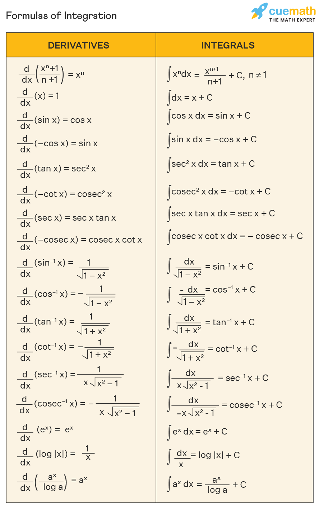

# Решение интегралов / Solution

Całka to jedno z podstawowych pojęć matematyki, szczególnie analizy matematycznej. Można ją rozumieć jako „uogólnioną sumę” lub „pole pod wykresem funkcji”

## 1. $\int 1 \, dx$
Формула / formuła
$$
\int c \, dx = cx + C
$$  
Здесь $c = 1$. Поэтому:  
$$
\int 1 \, dx = x + C
$$

---

## 2. $\int (x^2 + 2) \, dx$
Интеграл суммы равен сумме интегралов:  / podzelić całki
$$
\int (f(x) + g(x)) \, dx = \int f(x) \, dx + \int g(x) \, dx
$$  
Используем основную формулу:  / formuła
$$
\int x^n \, dx = \frac{x^{n+1}}{n+1} + C, \, n \neq -1
$$  
Интегрируем каждый член:  
$$
\int x^2 \, dx = \frac{x^{3}}{3}, \quad \int 2 \, dx = 2x
$$  
Складываем:  
$$
\int (x^2 + 2) \, dx = \frac{x^3}{3} + 2x + C
$$

---

## 3. $\int 2\sin(x) \, dx$
Интеграл синуса:  
$$
\int \sin(x) \, dx = -\cos(x) + C
$$  
Постоянный множитель выносится за знак интеграла:  / powinni 2 przepisać z przodu
$$
\int 2\sin(x) \, dx = 2 \int \sin(x) \, dx = -2\cos(x) + C
$$

---

## 4. $\int \frac{3}{x} \, dx$
Интеграл дроби $\frac{1}{x}$:  
$$
\int \frac{1}{x} \, dx = \ln|x| + C
$$  
Постоянный множитель $3$ выносится:  
$$
\int \frac{3}{x} \, dx = 3 \int \frac{1}{x} \, dx = 3\ln|x| + C
$$

---

## 5. $\int \frac{1}{x^2} \, dx$
Представим дробь как степень:  
$$
\frac{1}{x^2} = x^{-2}
$$  
Используем основную формулу интегрирования степенной функции:  / formuła
$$
\int x^n \, dx = \frac{x^{n+1}}{n+1} + C, \, n \neq -1
$$  
Здесь $n = -2$:  
$$
\int x^{-2} \, dx = \frac{x^{-1}}{-1} + C = -\frac{1}{x} + C
$$

---

## 6. $\int \left(\frac{1}{3}x^4 - 5\right) \, dx$
Разделим интеграл на два члена:  podzelić całki
$$
\int \left(\frac{1}{3}x^4 - 5\right) \, dx = \int \frac{1}{3}x^4 \, dx - \int 5 \, dx
$$  
Интегрируем каждый член:  
$$
\int \frac{1}{3}x^4 \, dx = \frac{1}{3} \cdot \frac{x^5}{5} = \frac{x^5}{15}, \quad \int 5 \, dx = 5x
$$  
Складываем:  
$$
\int \left(\frac{1}{3}x^4 - 5\right) \, dx = \frac{x^5}{15} - 5x + C
$$

---

## 7. $\int sin^2(x) + \cos^2(x) \, dx$
Из тригонометрического тождества:  
$$
\sin^2(x) + \cos^2(x) = 1
$$  
Поэтому:  
$$
\int (\sin^2(x) + \cos^2(x)) \, dx = \int 1 \, dx = x + C
$$

---

## 8. $\int 5\sin(x) + 3e^x \, dx$
Разделим интеграл на два члена:  
$$
\int (5\sin(x) + 3e^x) \, dx = \int 5\sin(x) \, dx + \int 3e^x \, dx
$$  
Интегрируем каждый член:  
$$
\int 5\sin(x) \, dx = -5\cos(x), \quad \int 3e^x \, dx = 3e^x
$$  
Складываем:  
$$
\int (5\sin(x) + 3e^x) \, dx = -5\cos(x) + 3e^x + C
$$

---

## 9. $\int \sqrt[3]{x} \, dx$
Запишем корень как степень:  
$$
\sqrt[3]{x} = x^{1/3}
$$  
Интегрируем по формуле степенной функции:  
$$
\int x^{1/3} \, dx = \frac{x^\frac{4}{3}}{\frac{4}{3}} + C = \frac{3}{4}x^{4/3} + C
$$

---

## 10. $\int \sqrt{10x} \, dx$
Разделим $\sqrt{10x}$ на множители:  
$$
\sqrt{10x} = \sqrt{10} \cdot \sqrt{x} = \sqrt{10} \cdot x^{1/2}
$$  
Выносим $\sqrt{10}$ за знак интеграла:  
$$
\int \sqrt{10x} \, dx = \sqrt{10} \int x^{1/2} \, dx
$$  
Интегрируем по формуле степенной функции:  
$$
\int x^{1/2} \, dx = \frac{x^\frac{3}{2}}{\frac{3}{2}} = \frac{2}{3}{x^\frac{3}{2}}
$$  
Подставляем:  
$$
\int \sqrt{10x} \, dx = \sqrt{10} \cdot \frac{2}{3}{x^\frac{3}{2}} = \frac{2\sqrt{10}}{3}{x^\frac{3}{2}} + C
$$

---

## 11. $\int \cos\left(\frac{5}{2}x + 3\right) \, dx$
Используем формулу интегрирования косинуса:  
$$
\int \cos(ax + b) \, dx = \frac{1}{a}\sin(ax + b) + C
$$  
Здесь $a = \frac{5}{2}$:  
$$
\int \cos\left(\frac{5}{2}x + 3\right) \, dx = \frac{1}{\frac{5}{2}}\sin\left(\frac{5}{2}x + 3\right) + C = \frac{2}{5}\sin\left(\frac{5}{2}x + 3\right) + C
$$

