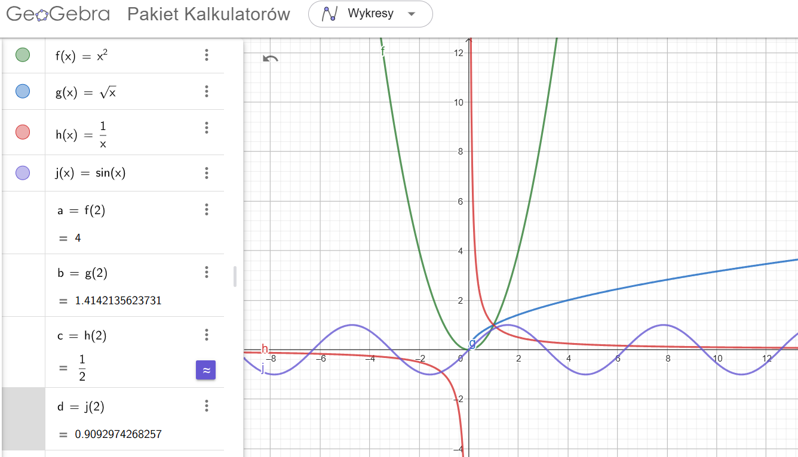
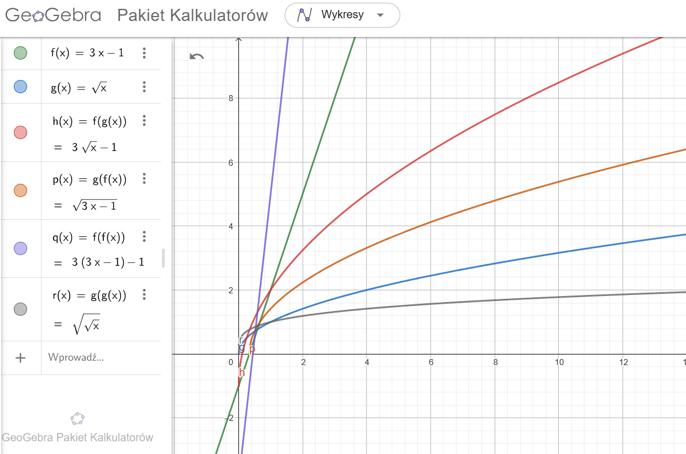
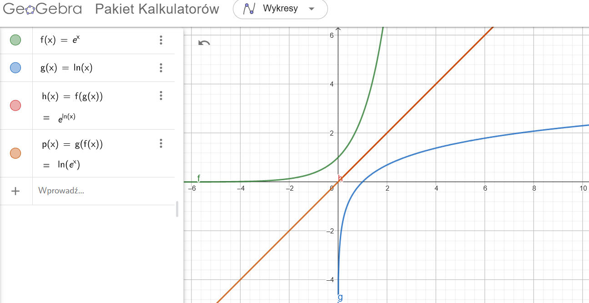

## Functions

1. Draw in a single Geogebra notebook the following functions:
   - $f(x) = x^2$
   - $g(x) = \sqrt{x}$
   - $h(x) = \frac{1}{x}$
   - $j(x) = \sin(x)$

Find value of all the above functions at $x = 2$.

2. Let $f(x) = 3x - 1$ and $g(x) = \sqrt{x}$. Find:
   - $f(g(x))$
   - $g(f(x))$
   - $f(f(x))$
   - $g(g(x))$

and visualize functions in a single Geogebra notebook.

3. Let $f(x) = e^x$ and $g(x) = \ln(x)$. Check: $f(g(x))$ and $g(f(x))$. What do you notice?

Obie kompozycje $ f(g(x)) $ i $ g(f(x)) $ są równe $ x $. Oznacza to, że funkcje $ f(x) = e^x $ i $ g(x) = \ln(x) $ są wzajemnie odwrotne wobec siebie.

4. We have function $f=(1,7), (2,9), (3,11)$. Give inverse function $f^{-1}$.
  ## Zadanie: Znalezienie funkcji odwrotnej

Dana jest funkcja $ f = (1, 7), (2, 9), (3, 11) $.

### Rozwiązanie

Funkcja odwrotna $ f^{-1} $ uzyskiwana jest przez zamianę zmiennych $x$ i $y$:

$$
f^{-1} = (7, 1), (9, 2), (11, 3).
$$

5. We have function $f=(1,7), (2,7), (3,11)$. Give inverse function $f^{-1}$.

### Odpowiedź:

$$
f^{-1} = (7, 1), (7, 2), (11, 3).
$$

6. We have function $f(x)= x-1$. Give inverse function $f^{-1}$. Show both functions on the same Geogebra notebook.

### Решение (Odpowiedź):

1. Обозначим $y = f(x) $:  
   $$
   y = x - 1.
   $$

2. Выразим $ x $ через $ y $:  
   $$
   x = y + 1.
   $$

3. Заменим $ y $ на $ x $ (в обратной функции аргумент обозначается как $ x $):  
   $$
   f^{-1}(x) = x + 1.
   $$
